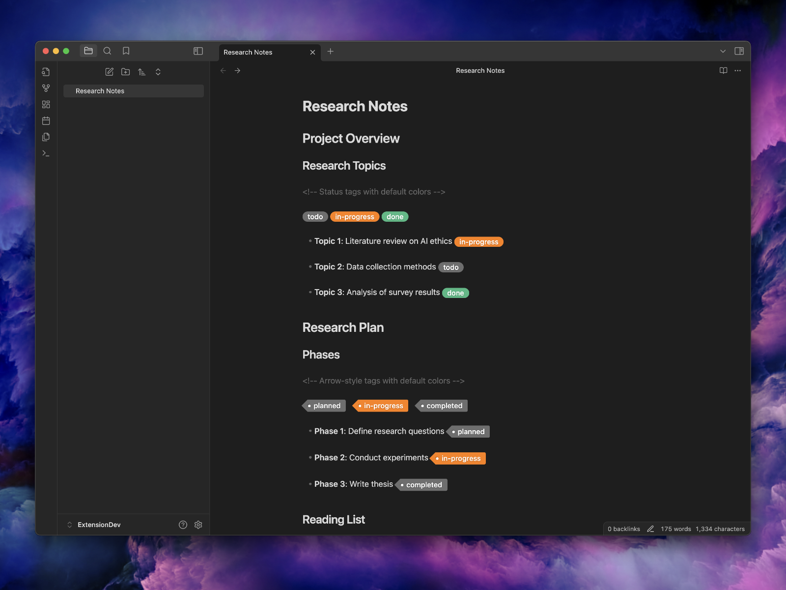

# Markdown Tags: Enhanced Tag Styling for Obsidian

Add visual flair to your Markdown documents with custom tag styles! **Markdown Tags** lets you highlight and style labels within Markdown using simple syntax, customizable colors, and optional arrow indicators—all within Obsidian.

[](https://buymeacoffee.com/binarynoir)
[](https://ko-fi.com/binarynoir)



## Features

### 🎨 Styled Tags

Highlight and style tags with ease using predefined or custom styles.

### 🖌️ Customizable Colors

Use predefined colors or specify custom hex codes for both background and foreground colors, enabling unlimited styling options.

### 📄 Flexible Syntax

Simple, flexible syntax options:

```markdown
((tag|label))
((tag|label|background-color))
((tag|label|background-color|foreground-color))
((<tag|label)) <!-- Adds an arrow to the left -->
```

### 🌈 Supports a Variety of Colors

Choose from predefined colors (`grey`, `green`, `orange`, etc.) or use custom hex codes to suit your design preferences.

---

## Getting Started

1. **Install** the plugin from the Obsidian Community Plugins.
2. **Enable** the plugin in the Obsidian settings.
3. **Add Tags** in your Markdown files using the syntax below.

### Basic Syntax Examples

#### Status Tags

```markdown
((tag|todo)) ((tag|in-progress|#ffcc00)) ((tag|done|#28a745|#ffffff))
```

#### Arrowed Tags

```markdown
((<tag|planned)) ((<tag|custom test))
```

#### Customizing Colors

```markdown
((tag|background|#ff4500)) ((tag|foreground||#ff6347)) ((tag|both colors|#32cd32|#ffffff))
```

---

## Tags and Colors

Available supported tags: **todo**, **planned**, **in-progress**, **doing**, **done**, **tip**,
**on-hold**, **tbd**, **proposed**, **draft**, **wip**, **mvp**,
**blocked**, **canceled**, **error**, **warning**, **warn**

For each tag, the following colors are available: **grey**, **green**, **yellow**, **orange**, **blue**, **purple**, **red**.

See Examples Markdown Documents

### Tag Examples

#### TODO

- `((tag|todo|grey))`
- `((tag|todo|green))`
- `((tag|todo|yellow))`
- `((tag|todo|orange))`
- `((tag|todo|blue))`
- `((tag|todo|purple))`
- `((tag|todo|red))`

#### PLANNED

- `((tag|planned|grey))`
- `((tag|planned|green))`
- `((tag|planned|yellow))`
- `((tag|planned|orange))`
- `((tag|planned|blue))`
- `((tag|planned|purple))`
- `((|planned|red))`

#### IN-PROGRESS

- `((|in-progress|grey))`
- `((|in-progress|green))`
- `((|in-progress|yellow))`
- `((|in-progress|orange))`
- `((|in-progress|blue))`
- `((|in-progress|purple))`
- `((|in-progress|red))`

#### DOING

- `((|doing|grey))`
- `((|doing|green))`
- `((|doing|yellow))`
- `((|doing|orange))`
- `((|doing|blue))`
- `((|doing|purple))`
- `((|doing|red))`

#### DONE

- `((|done|grey))`
- `((|done|green))`
- `((|done|yellow))`
- `((|done|orange))`
- `((|done|blue))`
- `((|done|purple))`
- `((|done|red))`

#### TIP

- `((|tip|grey))`
- `((|tip|green))`
- `((|tip|yellow))`
- `((|tip|orange))`
- `((|tip|blue))`
- `((|tip|purple))`
- `((|tip|red))`

... _(repeat as necessary for remaining tags: on-hold, tbd, proposed, draft, mvp, etc.)_

---

### With Arrow (using `((<tag|label|bgcolor))`)

#### MVP

- `((<tag|mvp|grey))`
- `((<tag|mvp|green))`
- `((<tag|mvp|yellow))`
- `((<tag|mvp|orange))`
- `((<tag|mvp|blue))`
- `((<tag|mvp|purple))`
- `((<tag|mvp|red))`

... _(repeat as necessary for remaining tags: on-hold, tbd, proposed, draft, mvp, etc.)_

---

## Advanced Options

### CSS Integration

Add custom styles by modifying the `style.css` file in the plugin folder to match your preferences.

### Error Handling

The plugin defaults to `grey` when invalid colors are detected to ensure a consistent and polished look.

---

## How to install the plugin

- Download the [Latest release](https://github.com/binarynoir/obsidian-markdown-tags/releases/latest)
- Extract the `obsidian-markdown-tags` folder from the zip to your vault `<vault>/.obsidian/plugins/`

### Manually installing the plugin

Copy over main.js, styles.css, manifest.json to your vault VaultFolder/.obsidian/plugins/obsidian-markdown-tags/.

---

## Contributing

> Feel free to submit issues, feature requests, or contribute code on GitHub.

### Development

```bash
npm install
npm run build
cp main.js manifest.json /path/to/your/vault/.obsidian/plugins/obsidian-markdown-tags
```

### Release

### Releasing new releases

- Update the changelog with new features and fixes
- Commit all changed files and create a pull request
- Update the `manifest.json` with the new version number, such as `1.0.1`, and the minimum Obsidian version required for your latest release.
- Update the `versions.json` file with `"new-plugin-version": "minimum-obsidian-version"` so older versions of Obsidian can download an older version of your plugin that's compatible.
- Create new GitHub release using the new version number as the "Tag version". Use the exact version number, don't include a prefix `v`. See here for an example: https://github.com/obsidianmd/obsidian-sample-plugin/releases
- Upload the files `manifest.json`, `main.js`, `styles.css` as binary attachments. Note: The manifest.json file must be in two places, first the root path of your repository and also in the release.
- Publish the release.

> You can simplify the version bump process by running `npm version patch`, `npm version minor` or `npm version major` after updating `minAppVersion` manually in `manifest.json`.
> The command will bump version in `manifest.json` and `package.json`, and add the entry for the new version to `versions.json`

```bash
git checkout main
git pull
git tag -a x.y.z -m "x.y.z"
git push --tags
```

The release will automatically be drafted.

## License

MIT License

---

## Support

If you encounter any issues or have questions, please open an issue on GitHub.

## Author

John Smith III

## Acknowledgments

Thanks to all contributors and users for their support and feedback.
